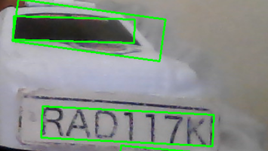
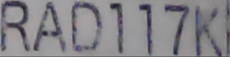
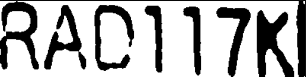

# ANPR Project - Car Number Plate Extraction System

This project implements a simple Automatic Number Plate Recognition (ANPR) pipeline based on the required assignment flow:

**Detection → Alignment → OCR → Validation → Temporal → Save**

## Features
- Captures frames from a webcam
- Detects a likely number plate region
- Aligns the plate using perspective correction
- Reads plate text using Tesseract OCR
- Validates OCR output using plate patterns
- Confirms plate text after multiple observations
- Saves confirmed plates into `data/plates.csv`

## Project Structure
```text
anpr-project/
├── README.md
├── requirements.txt
├── src/
│   ├── camera.py
│   ├── detect.py
│   ├── align.py
│   ├── ocr.py
│   ├── validate.py
│   ├── temporal.py
│   ├── storage.py
│   └── main.py
├── data/
│   ├── plates.csv
│   └── captures/
└── screenshots/
    ├── detection.png
    ├── alignment.png
    └── ocr.png

## Supported Plate Formats
The system validates the OCR output against standard regional patterns using Regular Expressions. Currently supported formats in `src/validate.py` include:
- `^[A-Z]{3}[0-9]{3}[A-Z]?$` (e.g., **RAB123A** or **RAB123**)
- `^[A-Z]{2}[0-9]{3}[A-Z]{2}$` (e.g., **RA123BC**)

You can easily add new regional formats by appending to the `PLATE_PATTERNS` list in `src/validate.py`.

## Sample Screenshots
Here is a visual breakdown of the ANPR pipeline in action:

### 1. Plate Detection


### 2. Plate Alignment (Captured Plate)
*When a plate is successfully detected and temporally confirmed, its cropped image is automatically saved to the `data/captures/` directory (e.g., `data/captures/RAE327H.png`).*


### 3. OCR Image Pre-processing
"# car_plate_number_extractor" 
